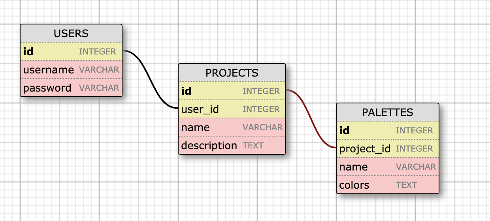

# Palette Picker - API

## Description 
A RESTful API built with Express and Knex to support the [PalettePicker Front-End UI](https://github.com/KevinKra/PalettePicker-fe).

## Schema 

## Endpoints 

### Users 

#### To SIGN IN a  user, you must send the username and password in the body. The response will be an object with the id of the user on record. 

| URL | METHOD | OPTIONS | EXAMPLE RESPONSE |
| ----|------|---------|---------------- |
| `/api/v1/users` | POST | `body: {username: <STRING>, password: <STRING>}` | `{id: 433}` |  

---

#### To CREATE A NEW USER, you must send the username and password in the body. The response will be an object with the id of the newly created user. 

| URL | METHOD | OPTIONS | EXAMPLE RESPONSE |
| ----|------|---------|---------------- |
| `/api/v1/users/new` | POST | `body: {username: <STRING>, password: <STRING>}` | `{id: 177}` |  

### Projects 

#### Projects can either be retrieved all at once with their respective palettes, or individually with their own meta data.
##### You must have an existing User ID to ACCESS or CREATE projects.  

| URL | METHOD | OPTIONS | EXAMPLE RESPONSE |
| ----|------|---------|---------------- |
| `/api/v1/users/:user_id/projects` | GET | Not Required | `[{ id:1, title: 'New Project', description: 'Example text', palettes: [{ id: 3, name: 'Example palette', colors: ['#000000', '#ffffff', '#88888']}]}]` |  
| `/api/v1/users/:user_id/projects/:project_id` | GET | Not Required | `[{ id: 1, title: 'New Project', description: '' }]` | 

---
#### To CREATE A NEW PROJECT, you must send the USER ID along with the title and description in the body.The response will return the ID of the newly created project. 

| URL | METHOD | OPTIONS | EXAMPLE RESPONSE |
| ----|------|---------|---------------- |
| `/api/v1/users/projects/new` | POST | `{ user_id: 1, name: 'New Project', description: '' }` | `[{ id: 3 }]` | 

--- 
#### To CHANGE THE NAME / DESCRIPTION OF A PROJECT, you MUST include the name in the body; even when only changing the description. The response will return the ID and Name of the edited project. 

| URL | METHOD | OPTIONS | EXAMPLE RESPONSE |
| ----|------|---------|---------------- |
| `/api/v1/users/projects/:id/edit` | PATCH | `{ name: 'New Title', description: 'Optional text' }` | `[{ id: 3, name: 'New Title' }]` | 

--- 
#### To DELETE A PROJECT, you need only include the user_id and id of the project in the params. Deleting a project WILL ALSO DELETE ALL PALETTES ASSOCIATED WITH THAT PROJECT. The response will return the ID of the deleted Project. 

| URL | METHOD | OPTIONS | EXAMPLE RESPONSE |
| ----|------|---------|---------------- |
| `/api/v1/users/:user_id/projects/:id` | DELETE | Not required | `3` | 

--- 
#### To GET ALL PALETTES associated with the user, you need only the user_id. The response will return an array of all the associated palettes. 

| URL | METHOD | OPTIONS | EXAMPLE RESPONSE |
| ----|------|---------|---------------- |
| `/api/v1/users/:user_id/palettes` | GET | Not required | `[{ name: 'palette_1', colors: ['#ffffff', '#000000', '#e9e9e9']}]` | 

--- 
#### To CREATE A NEW PALETTE, you will need the project_id included in the params, and the name and colors included in the body. The colors property must be an array of color hex codes as strings including the `#` symbol in each string. The response will return the ID of the newly created palette.

| URL | METHOD | OPTIONS | EXAMPLE RESPONSE |
| ----|------|---------|---------------- |
| `/api/v1/users/projects/:project_id/palettes'` | POST | `{name: 'new_palette', colors: ['#ffffff', '#000000', '#e9e9e9']}` | `{ id: 31}` | 

--- 
#### To DELETE A PALETTE, you need to include the project_id and id of the palette in the params. The response will return the ID of the successfully deleted palette. 

| URL | METHOD | OPTIONS | EXAMPLE RESPONSE |
| ----|------|---------|---------------- |
| `/api/v1/projects/:project_id/palettes/:palette_id` | DELETE | Not required | `7` | 

Note: All of these endpoints will return semantic errors if something is wrong with the request.
